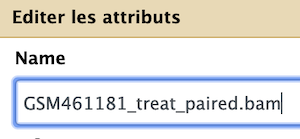

# HISAT2  (option for 50 % of attendees)

----

  1. create a new history and name it `HISAT2`
  2. Import the 11 datasets from the RNAseq data library to this `RNA STAR` history, plus the Drosophila_melanogaster.BDGP6.95.gtf file
  3. Select the `HISAT2` tool with the following parameters to map your reads on the reference genome:
      1. `Source for the reference genome`: Use a builtin genome
      2. `Select a reference genome` : **dm6**
      3. `Is this a single or paired library:` Single-End
      4. `FASTA/Q file:
          - `GSM461176_untreat_single.fastq.gz`
          - `GSM461179_treat_single.fastq.gz`
          - `GSM461182_untreat_single.fastq.gz`
      5. `Specify strand information:` Unstranded
      6. `Summary options`
          - `Output alignment summary in a more machine-friendly style.`: YES
          - `Print alignment summary to a file.`: YES
      6. Leave other settings as defaults
  4. `Execute`
----

  Redo the HISAT2 run for paired-end files
  
  3. Rerun the `HISAT2` tool with the following parameters to map your reads on the reference genome:
      1. `Source for the reference genome`: Use a builtin genome
      2. `Select a reference genome` : **dm6**
      3. `Is this a single or paired library:` Paired-End
      4. `FASTA/Q file #1`:
          - `GSM461177_1_untreat_paired.fastq.gz`
          - `GSM461178_1_untreat_paired.fastq.gz`
          - `GSM461180_1_treat_paired.fastq.gz`
          - `GSM461181_1_treat_paired.fastq.gz`
      4. `FASTA/Q file #2`:
          - `GSM461177_2_untreat_paired.fastq.gz`
          - `GSM461178_2_untreat_paired.fastq.gz`
          - `GSM461180_2_treat_paired.fastq.gz`
          - `GSM461181_2_treat_paired.fastq.gz`
      5. `Specify strand information:` Unstranded
      6. Leave other settings as defaults (since you are redoing a run)
  4. `Execute`

## Rename your datasets !

----

You need now to rename you datasets to facilitate your downstream analysis.

Be quiet and focus ! No hurry, this is an *important task* in the analysis.

1. Search and select datasets with HISAT2 

2. Click on the info icon  of both `(BAM)` and `Mapping summary` files

3. Copy the name or one of the two names of the datasets as shown bellow

4. Now click on the pencil icon of the *_same_* dataset

5. Paste your text in the `Name` field of the dataset

6. Edit your text as follow for `Mapping summary` files

7. Edit your text as follow for `(BAM)` files

8. repeat _ad lib_ for all Mapping summary and (BAM) files 
