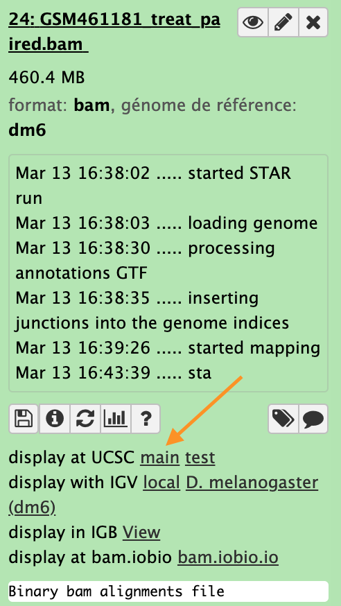

# Inspection of the mapping results

----
## UCSC genome browser  

click the ucsc main link as indicated by the red arrow

Zoom to chr4:540,000-560,000 (Chromosome 4 between 540 kb to 560 kb)

## IGV  

Zoom to chr4:540,000-560,000 (Chromosome 4 between 540 kb to 560 kb)

----

